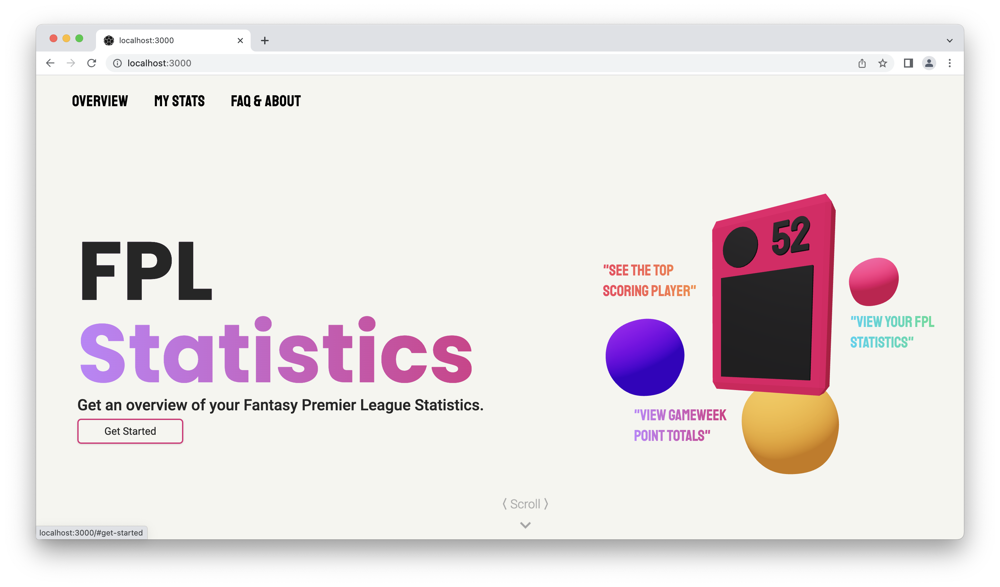

<h1 align="center">
   
     
   
  FPL Statisitics
   
</h1>

     
     

FPL (Fantasy Premier League) statistics is a webpage built to display the different statistics for a given Premier leage GameWeek. It displays general statistics such as the best player for a particular game week and the amount of players participating in the FPL. The site also covers data showcasing the average and highest point totals across all of the game weeks. 

&nbsp;

  

&nbsp;

### Technology

This site makes use of Next.js/React, Three.js, Tailwind, Framer Motion, and the Fantasy Premier League Statisitics API.

### Screenshots

